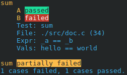

<!--
    Copyright © 2025 Gaël Fortier <gael.fortier.1@ens.etsmtl.ca>
-->

THIS IS A WORK IN PROGRESS
Copyright © 2025 Gaël Fortier <gael.fortier.1@ens.etsmtl.ca>

## GT (Gee-Tee)
The C programming langage lacks certains features that allow mocking functions for proper unit testing. GT is a unit test and mocking library made for projects written in C. With this library, it is now possible to make mocks of functions without changing the source code. 

When an assertion fails, it displays a colorful report with useful information, such as the line number, the expressions that failed the assertion and the values held by the expressions. 

The library mechanism that handle functions mocks is done at compile and runtime time. The library requires that the source is compiled with GCC's `-fpatchable-function-entry=50` argument, as the library uses the padding generated to patch the compiled binary with arbitrary x86 instructions. [source](gt/src/patch.c)

### Documentation

WIP

### Installation 

WIP

### Demo & example

WIP
