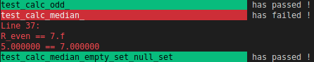

<!--
    Copyright © 2025 Gaël Fortier <gael.fortier.1@ens.etsmtl.ca>
-->
## gt
gt is an assertion library for writing unit tests in C. It provides a non-intrusive way of writing assertion to validate the behavior of the tested code. When an assertion fails, it displays a colorful report with useful information, such as the line number, the expressions that failed the assertion and the values held by the expressions. 

## Macros

### Assertion macros

The table below contains the macro signature and a short description of its use case.

| Macro                        | Description                                            |
| ---------------------------- | ------------------------------------------------------ |
| `_gt_test_int_eq(n1, n2)`    | Asserts equality of 2 integer values.                  |
| `_gt_test_ptr_eq(n1, n2)`    | Asserts equality of 2 pointer values.                  |
| `_gt_test_float_eq(n1, n2)`  | Asserts equality of 2 real values.                     |
| `_gt_test_str_eq(n1, n2)`    | Asserts equality of 2 string values.                   |
| `_gt_test_int_neq(n1, n2)`   | Asserts inequality of 2 integer values.                |
| `_gt_test_ptr_neq(n1, n2)`   | Asserts inequality of 2 pointer values.                |
| `_gt_test_float_neq(n1, n2)` | Asserts inequality of 2 real values.                   |
| `_gt_test_str_neq(n1, n2)`   | Asserts inequality of 2 string values.                 |
| `_gt_test_int_gt(n1, n2)`    | Asserts n1 greater than n2 for integer values          |
| `_gt_test_float_gt(n1, n2)`  | Asserts n1 greater than n2 for real values             |
| `_gt_test_int_lt(n1, n2)`    | Asserts n1 lesser than n2 for integer values           |
| `_gt_test_float_lt(n1, n2)`  | Asserts n1 lesser than n2 for real values              |
| `_gt_test_int_gte(n1, n2)`   | Asserts n1 greater or equal to n2 for integer values   |
| `_gt_test_float_gte(n1, n2)` | Asserts n1 greater or equal to than n2 for real values |
| `_gt_test_int_lte(n1, n2)`   | Asserts n1 lesser or equal to n2 for integer values    |
| `_gt_test_float_lte(n1, n2)` | Asserts n1 lesser or equal to than n2 for real values  |

### Debug print macro

The macro below is a wrapper of the function `printf`. This macro displays the location where it was used, then calls printf with provided parameters. This macro is useful for keeping track of the location of temporary debug prints. 
 
- `_gt_test_print(format, ...)` : Shows the function and line of usage and makes a box arround diplayed text.

### Function signature macro

Macros to use when creating and using a test function. 

- `_gt_test(name, opt_case)` : Macro that names the test function for you.

- `_gt_run(name, opt_case)` : Runs a test function named with `_gt_test` macro.

